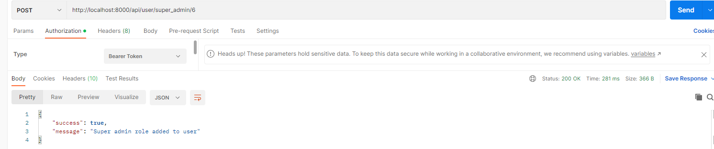
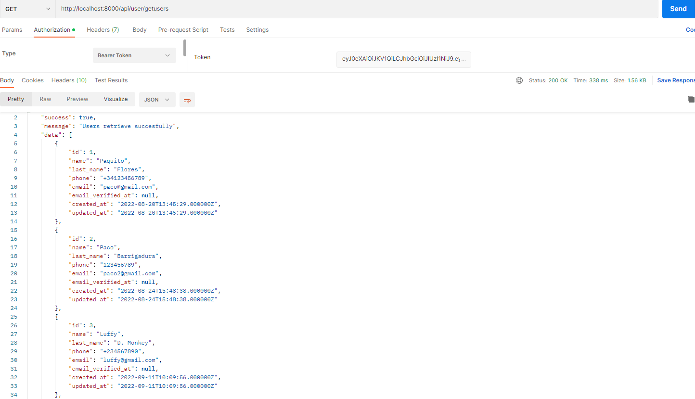
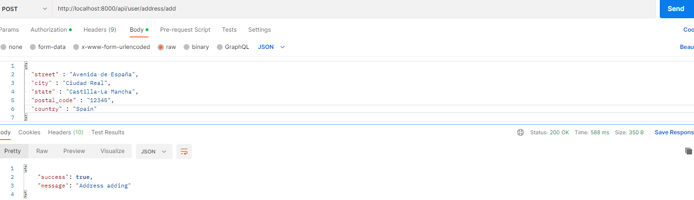
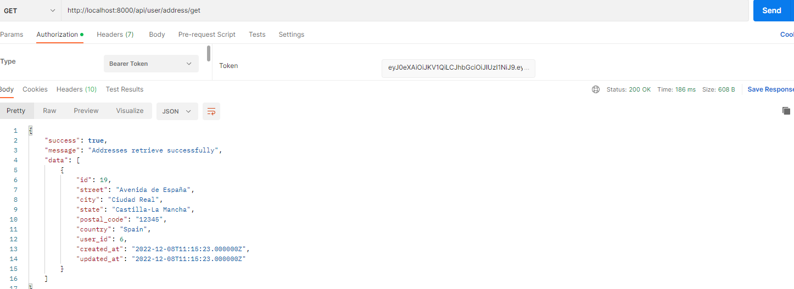
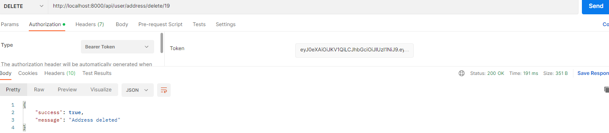

<h1 align="center">
    Green Gold
</h1>

___

<h5 align="center">Back-End realizado como práctica personal utilizando Laravel tras finalizar el Bootcamp de GeeksHubs. Por José Carlos Núñez. </h5>

    <a href="#About">About</a> ·
    <a href="#Usage">Usage</a> ·
    <a href="#Features">Features</a>

___

## About

El Back-End que he desarrollado con Laravel, el cual consiste en un E-commerce de venta de productos tropicales, en especial aguacates.  
Compuesto de varios End-points y dinstintas utilidades así como CRUD. Es un trabajo aún incompleto pero al que le estoy dedicando tiempo por que ser algo muy completo.

 
 Tablas y relaciones

----

## Usage

Debido a que Heroku ha pasado a ser de pago, para utilizarla debes descargar el repositorio e inicializarlo en tu máquina local.

<strong>End-Points de Usuario</strong>

En primer lugar podemos ver el End-point de register.

 
 Register

LogIn, para hacer el login, debemos introducir email y password. El login nos devolverá un token con el que podremos utilizar otros End-Points.

 
 Login

LogOut, para hacer efectivo el LogOut, debemos introducir el token devuelto en el Login como Bearer Token.

 
 LogOut

Profile, para obtener los datos de usuario, deberemos introducir el token  devuelto en el Login como Bearer Token.

 
 Profile

<strong>End-Points de Administrador</strong>

En primer lugar podemos ver el End-point en el que podremos añadir nuevos admin mediante su ID.

 
 Add super admin

El siguiente End-point consiste en eliminar un admin mediante su ID.

 
 Delete super admin

Ahora utilizaremos un End-Point de administrador, el cual nos muestra todos los usuarios registrador en nuestra BBDD.

 
 Perfiles de usuarios

<strong>End-Points de Direcciones</strong>

End-Points para crear, modificar, leer o eliminar la información de la dirección de envío de cada usuario.

Crear dirección, para ello introducimos la información necesaria y el token.

 
 Añadir dirección

Leer direcciones, para ello debemos introducir el token.

 
 Leer direcciones registradas

Modificar direccion que tengamos registrada. Necesitaremos token y ID de la direccoón a modificar.

 
 Modificar dirección

Eliminar dirección. Para ello necesitamos token y ID de la direccíon que queramos eliminar.

 
 Eliminar dirección

----

## Features
Proyecto realizado con las siguientes tencologías: 

 ·  ·  ·  · 

